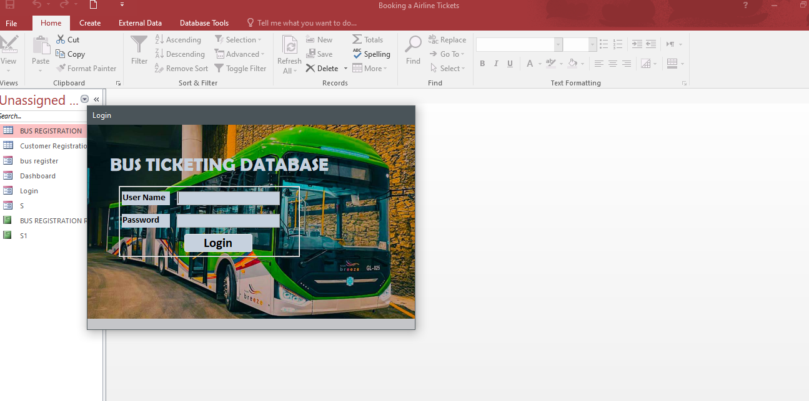
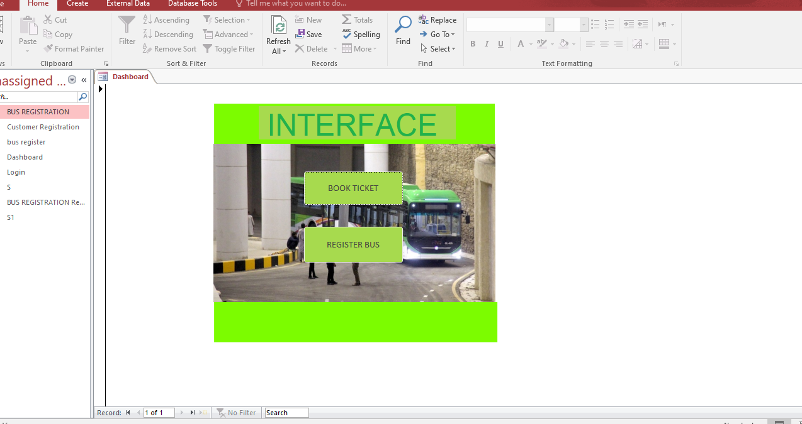
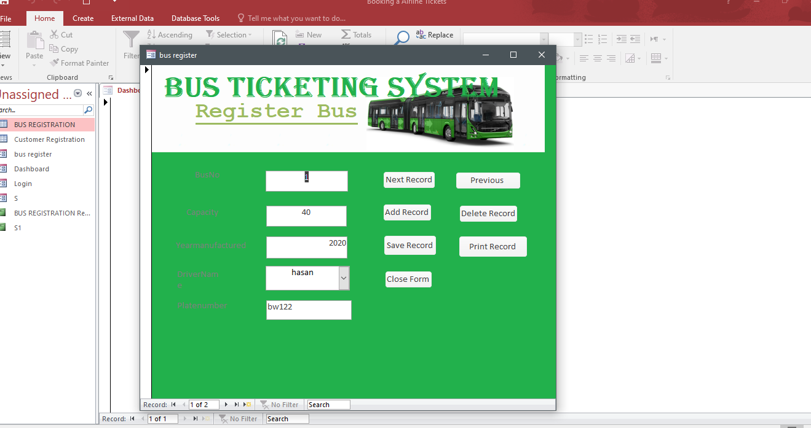
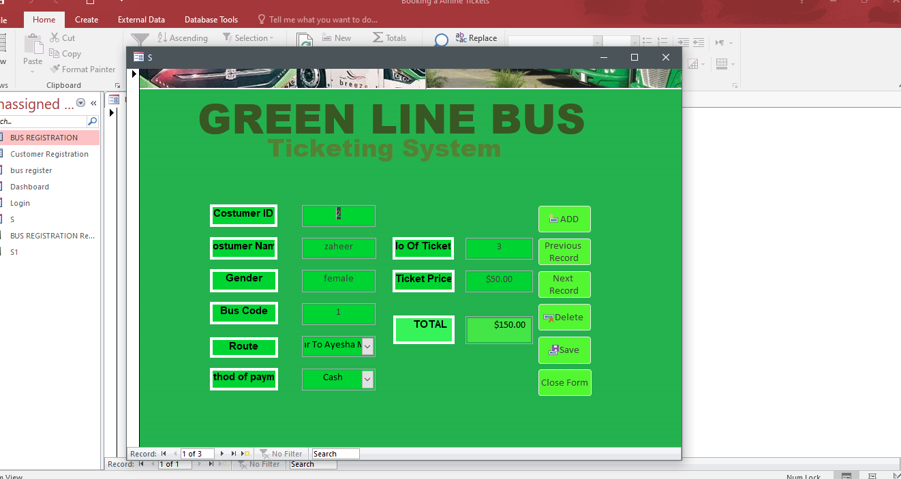
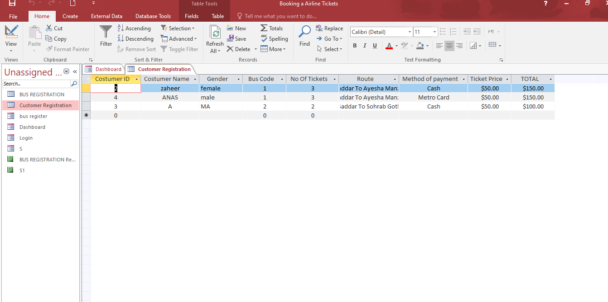
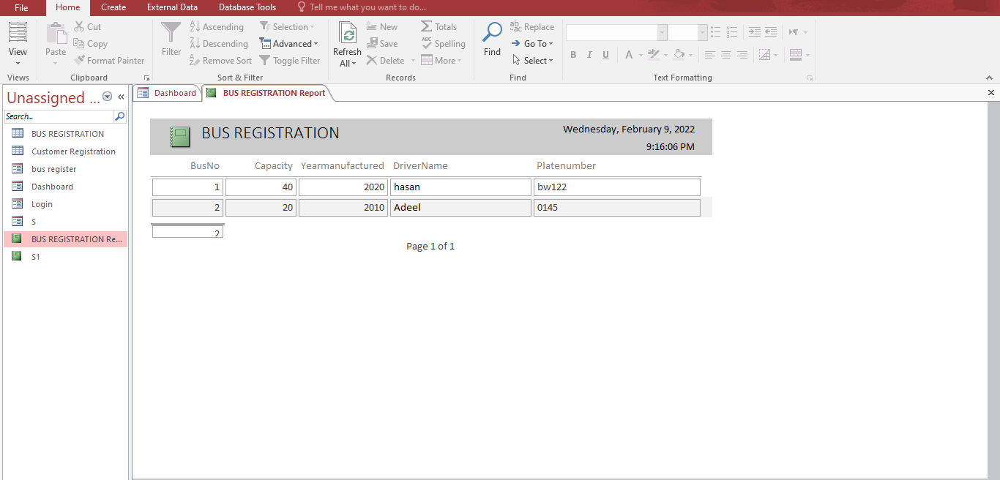
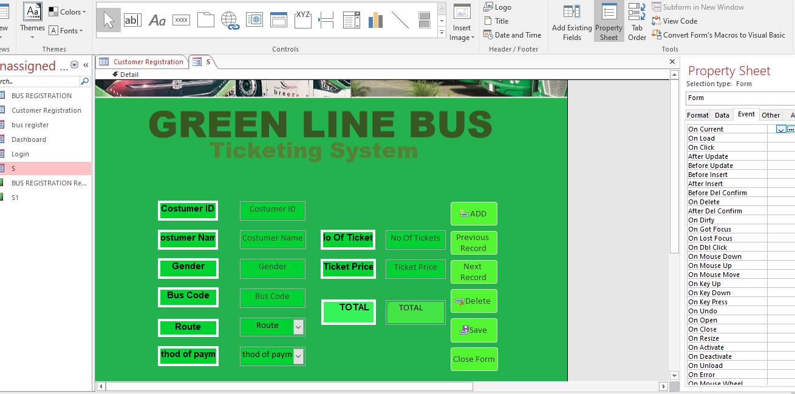
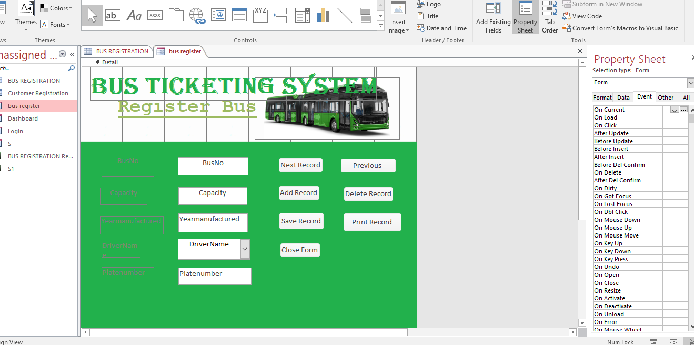
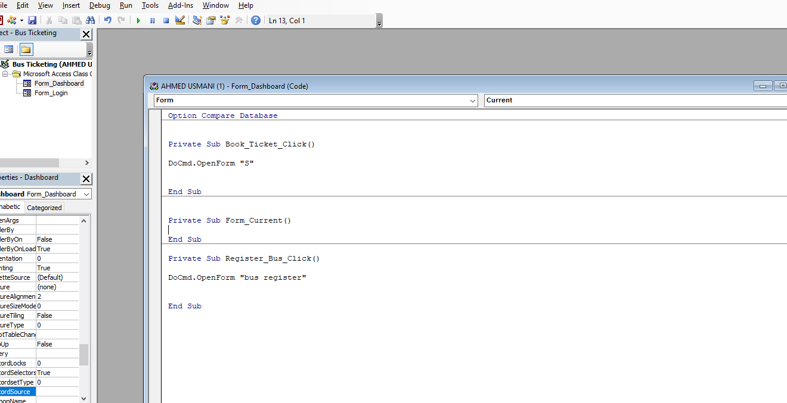
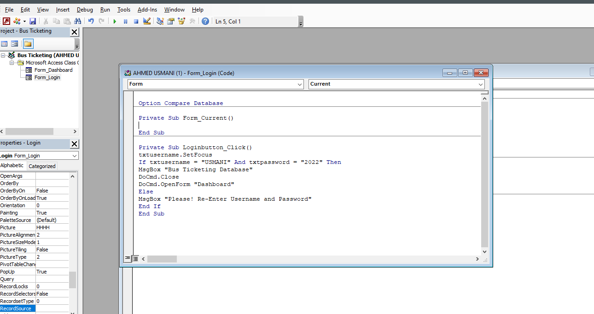

# 🚌 Bus Ticket Reservation System

<div align="center">


A fully functional **Bus Ticket Reservation & Management System** built using **Microsoft Access** and **VBA (Visual Basic for Applications)**, developed as the 1st Semester ICT Lab Final Project at Bahria University. The system provides a complete end-to-end solution for managing bus registrations, passenger bookings, ticket pricing, and automated report generation — all through a polished, interactive GUI.

</div>

---

## 📸 Screenshots

<table>
  <tr>
    <td align="center"><br/><b>🔐 Login Screen</b></td>
    <td align="center"><br/><b>🏠 Main Dashboard</b></td>
  </tr>
  <tr>
    <td align="center"><br/><b>🚌 Register Bus (Form View)</b></td>
    <td align="center"><br/><b>🎫 Book Ticket (Green Line Bus)</b></td>
  </tr>
  <tr>
    <td align="center"><br/><b>📋 Customer Registration Table</b></td>
    <td align="center"><br/><b>📊 Bus Registration Report</b></td>
  </tr>
  <tr>
    <td align="center"><br/><b>🎨 Ticket Form (Design View)</b></td>
    <td align="center"><br/><b>🎨 Bus Register (Design View)</b></td>
  </tr>
  <tr>
    <td align="center"><br/><b>💻 VBA — Dashboard Logic</b></td>
    <td align="center"><br/><b>💻 VBA — Login Authentication</b></td>
  </tr>
</table>

---

## ✨ Features

### 🔐 Authentication
- **Secure Login** — Username & password authentication via VBA (`USMANI` / `2022`)
- Invalid credentials trigger an error prompt before retrying

### 🏠 Dashboard
- Central hub with two primary actions: **Book Ticket** and **Register Bus**
- Visual bus-themed background for an immersive UX

### 🚌 Bus Registration
- Register fleet buses with **Bus No**, **Capacity**, **Year Manufactured**, **Driver Name**, and **Plate Number**
- CRUD operations: Add, Save, Delete, Print, Next/Previous record navigation
- Auto-generated **Bus Registration Reports** with timestamps

### 🎫 Ticket Booking (Green Line Bus)
- Book tickets with full passenger details:
  - **Customer ID**, **Customer Name**, **Gender**
  - **Bus Code**, **Route**, **Method of Payment**
  - **No. of Tickets**, **Ticket Price** (auto-calculated `TOTAL`)
- Payment options: **Cash** or **Metro Card**
- Record navigation, Save, Delete, and Close Form actions

### 📋 Customer Registration Table
- Datasheet view of all booked passengers
- Columns: Customer ID, Name, Gender, Bus Code, No. of Tickets, Route, Payment Method, Ticket Price, **TOTAL**
- Automatic total calculation per booking record

### 📊 Report Generation
- Auto-formatted **BUS REGISTRATION Report** — lists all registered buses with full details, timestamp-stamped and paginated

---

## 🗃️ Database Structure

The system is built on a Microsoft Access (`.accdb`) database with the following objects:

### 📦 Tables
| Table | Fields |
|---|---|
| **BUS REGISTRATION** | BusNo, Capacity, YearManufactured, DriverName, Platenumber |
| **Customer Registration** | CustomerID, CustomerName, Gender, BusCode, NoOfTickets, Route, MethodOfPayment, TicketPrice, Total |

### 📋 Forms
| Form | Purpose |
|---|---|
| **Login** | User authentication with VBA validation |
| **Dashboard** | Main navigation hub |
| **S** (Book Ticket) | Green Line Bus passenger booking form |
| **bus register** | Bus fleet registration form |
| **Customer Registration** | Datasheet view of all customers |

### 📊 Reports
| Report | Purpose |
|---|---|
| **BUS REGISTRATION Report** | Auto-generated fleet report with date/time stamp |
| **S1** | Customer booking report |

### 💻 VBA Modules (Form Code)
| Module | Logic |
|---|---|
| `Form_Dashboard` | Routes to Book Ticket (`DoCmd.OpenForm "S"`) and Register Bus (`DoCmd.OpenForm "bus register"`) |
| `Form_Login` | Validates credentials and opens Dashboard on success |

---

## 🧠 ICT Concepts Applied

| Concept | Application |
|---|---|
| **Database Design** | Relational tables with primary keys (CustomerID, BusNo) |
| **Forms** | Interactive GUI forms for data entry and CRUD |
| **Reports** | Auto-generated, timestamp-stamped formatted reports |
| **VBA Macros** | Event-driven programming for button clicks and form navigation |
| **Queries** | Calculated fields (Total = NoOfTickets × TicketPrice) |
| **Data Validation** | Login authentication logic with conditional branching |
| **UI Design** | Background images, color themes, and custom controls |

---

## 🛠️ Tech Stack

| Layer | Technology |
|---|---|
| **Database** | Microsoft Access 2016+ (`.accdb`) |
| **Programming** | VBA (Visual Basic for Applications) |
| **UI** | Access Forms with custom backgrounds and controls |
| **Reporting** | Access built-in Report Designer |
| **IDE** | Microsoft Access VBA Editor |

---

## 🚀 Getting Started

### Prerequisites

- **Microsoft Access 2013** or newer (part of Microsoft Office)
- Windows OS (Access is Windows-only)

### Running the Application

1. **Clone or Download** this repository:
   ```bash
   git clone https://github.com/AnasQ2003/Bus_Ticket_Reservation.git
   ```

2. **Open the database**: Double-click `ICT LAB FINAL PROJECT.zip`, extract it, then open **`AHMED USMANI (1).accdb`** in Microsoft Access.

3. **Enable Macros**: If prompted, click **"Enable Content"** to allow VBA macros to run.

4. **Login** using the credentials:
   - **Username**: `USMANI`
   - **Password**: `2022`

5. From the **Dashboard**, choose:
   - **Book Ticket** → Fill in passenger details and save
   - **Register Bus** → Add new buses to the fleet

---

## 📚 Course Context

| Detail | Info |
|---|---|
| **University** | Bahria University, Pakistan |
| **Course** | Information & Communication Technology (ICT) |
| **Semester** | 1st Semester |
| **Project Type** | ICT Lab Final Project |
| **Key Concepts** | Database design, VBA, Forms, Reports, UI/UX |

---

## 👨‍💻 Author

**Anas Qayyum**
- GitHub: [@AnasQ2003](https://github.com/AnasQ2003)
